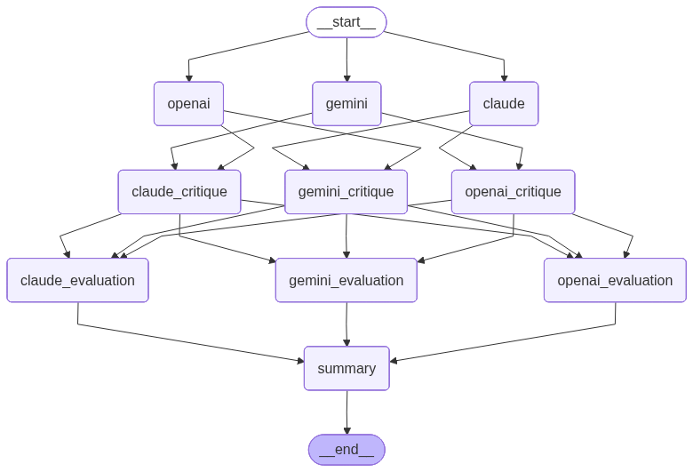

# Colosseum

Colosseum is a multi-LLM chat arena. One prompt is sent to OpenAI, Claude, and Gemini in parallel, each model gives an initial answer, and then each model critiques the other two. The results are displayed side by side in a React UI backed by FastAPI and LangGraph.

## Stack

- **Frontend:** React + Vite
- **Backend:** LangGraph, LangSmith, DeepEval, FastAPI, Pydantic
- **AI Providers:** OpenAI, Anthropic Claude, Google Gemini

## Project structure

```text
Colosseum/
├── config/
│   ├── config.py        # Shared config loader
│   └── config.yaml      # Non-secret runtime config (backend + frontend)
├── backend/
│   ├── main.py          # FastAPI routes
│   ├── graph.py         # LangGraph 2-phase graph
│   ├── llm_clients.py   # API clients for all 3 providers
│   ├── schemas.py       # Pydantic request/response models
│   ├── pyproject.toml
│   ├── .env             # API keys only (copy from .env.example, not committed)
│   ├── .env.example
│   └── Dockerfile
├── frontend/
│   ├── src/
│   │   ├── App.jsx
│   │   ├── main.jsx
│   │   └── styles.css
│   ├── package.json
│   ├── vite.config.js
│   └── Dockerfile
├── images/
│   ├── colosseum.png
│   └── debate_llm.png
├── docker-compose.yml
└── README.md
```

## How it works


**Phase 1 — Initial responses (parallel)**
All three models answer the user's question simultaneously.

**Phase 2 — Cross-critique (parallel)**
Each model receives the other two models' responses and critically evaluates them. All three critiques run in parallel.

Both phases are orchestrated by a LangGraph `StateGraph`, and the backend exposes the workflow through a FastAPI API consumed by the Vite frontend.

## LangGraph



## 1. Running with Docker Compose (recommended)

> **Prerequisites:** Docker Desktop must be installed and **running** before executing any `docker` command.  
> On **Windows** and **macOS**, Docker Desktop does not start automatically — open it from the Start menu / Applications and wait until the whale icon in the system tray shows "Docker Desktop is running".  
> On **Linux**, the Docker daemon starts automatically as a system service, so no manual step is needed.

**Step 1 — Create `backend/.env` with your API keys:**

```bash
cp backend/.env.example backend/.env
# then edit backend/.env and fill in your keys
```

```env
OPENAI_API_KEY=...
ANTHROPIC_API_KEY=...
GEMINI_API_KEY=...
```

Non-secret runtime settings are configured in `config/config.yaml`:

```yaml
models:
  openai: gpt-4.1-mini
  anthropic: claude-haiku-4-5-20251001
  gemini: gemini-2.5-flash

gemini:
  timeout_seconds: 30
  max_retries: 3
  retry_backoff_seconds: 1.0

langsmith:
  tracing: true
  project: colosseum
  endpoint: https://api.smith.langchain.com

frontend:
  api_base: http://localhost:8000
```

`backend/.env` should contain API keys only:

```env
OPENAI_API_KEY=...
ANTHROPIC_API_KEY=...
GEMINI_API_KEY=...
LANGSMITH_API_KEY=...
```

**Step 2 — Build and start both services:**

```bash
docker compose up --build
```

- Frontend: http://localhost:5173
- Backend health: http://localhost:8000/health

The backend image is built with `uv` — no `requirements.txt` needed, dependencies come from `pyproject.toml`.  
`backend/.env` is read by Compose at runtime and injected as container environment variables. The file is never copied into the image.

If the containers are already built, you can restart them without rebuilding:

```bash
docker compose up
```

## 2. Manual setup — Backend

```bash
cd backend
uv sync
cp .env.example .env
# fill in your API keys in .env
uv run uvicorn main:app --reload
```

If this is your first time using `uv`, install it first:

```bash
pip install uv
```

## 3. Manual setup — Frontend

```bash
cd frontend
npm install
npm run dev
```

The dev server listens on all interfaces (`host: true` in `vite.config.js`) at port 5173.

## 4. API

### POST `/chat`

Request body:

```json
{ "message": "What is the difference between RAG and fine-tuning?" }
```

Response:

```json
{
  "responses": [
    { "provider": "openai",    "model": "gpt-4.1-mini",              "content": "...", "error": null },
    { "provider": "anthropic", "model": "claude-haiku-4-5-20251001", "content": "...", "error": null },
    { "provider": "google",    "model": "gemini-2.5-flash",          "content": "...", "error": null }
  ],
  "critiques": [
    { "provider": "openai",    "model": "gpt-4.1-mini",              "critiqued_providers": ["anthropic", "google"], "content": "...", "error": null },
    { "provider": "anthropic", "model": "claude-haiku-4-5-20251001", "critiqued_providers": ["openai", "google"],    "content": "...", "error": null },
    { "provider": "google",    "model": "gemini-2.5-flash",          "critiqued_providers": ["openai", "anthropic"], "content": "...", "error": null }
  ]
}
```

### GET `/results`

Returns the initial responses from the most recent `/chat` request.

### GET `/health`

Returns `{ "status": "ok" }`.

## Notes

- No streaming, auth, or persistent chat history.
- Run `python graph.py` from the `backend/` directory to generate a graph diagram at `backend/artifacts/chat_graph.png`.
- You can later add debate mode, voting, synthesis, or conversation memory.
