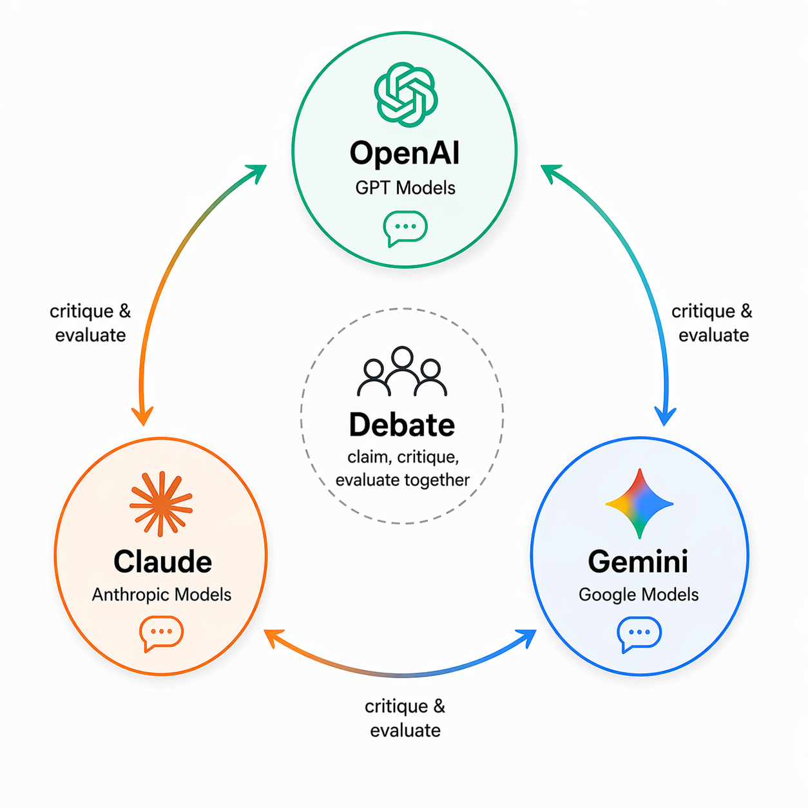

# Colosseum



A chat app where one user prompt is sent to OpenAI, Claude, and Gemini simultaneously. All three models give initial answers, then each model critiques the other two. Results are shown side by side in a React UI.

## Stack

- **Frontend:** React + Vite
- **Backend:** FastAPI + LangGraph + LangSmith, Pydantic
- **AI Providers:** OpenAI, Anthropic Claude, Google Gemini

## Project structure

```text
Colosseum/
├── backend/
│   ├── main.py          # FastAPI routes
│   ├── graph.py         # LangGraph 2-phase graph
│   ├── llm_clients.py   # API clients for all 3 providers
│   ├── schemas.py       # Pydantic request/response models
│   └── pyproject.toml
├── frontend/
│   ├── src/
│   │   ├── App.jsx
│   │   ├── main.jsx
│   │   └── styles.css
│   ├── package.json
│   └── vite.config.js
└── README.md
```

## How it works

**Phase 1 — Initial responses (parallel)**
All three models answer the user's question simultaneously.

**Phase 2 — Cross-critique (parallel)**
Each model receives the other two models' responses and critically evaluates them. All three critiques run in parallel.

Both phases are orchestrated by a LangGraph `StateGraph`.

## 1. Backend setup

```bash
cd backend
uv sync
cp .env.example .env
uv run uvicorn main:app --reload
```

If this is your first time using `uv`, install it first:

```bash
pip install uv
```

Set your API keys in `backend/.env`:

```env
OPENAI_API_KEY=...
ANTHROPIC_API_KEY=...
GEMINI_API_KEY=...
```

Optional — override default models:

```env
OPENAI_MODEL=gpt-4.1-mini
ANTHROPIC_MODEL=claude-haiku-4-5-20251001
GEMINI_MODEL=gemini-2.5-flash
```

Optional — enable LangSmith tracing for LangGraph runs:

```env
LANGSMITH_TRACING=true
LANGSMITH_API_KEY=...
LANGSMITH_PROJECT=colosseum
LANGSMITH_ENDPOINT=https://api.smith.langchain.com
```

Then restart the backend and send a request to `/chat`. You should see traces in your LangSmith project.

## 2. Frontend setup

```bash
cd frontend
npm install
npm run dev
```

## Run frontend + backend with Docker Compose

From the project root:

```bash
docker compose up --build
```

Then open:

- Frontend: http://localhost:5173
- Backend health: http://localhost:8000/health

Environment variables for API providers can be passed from your shell before running Compose:

```bash
export OPENAI_API_KEY=...
export ANTHROPIC_API_KEY=...
export GEMINI_API_KEY=...
```

On PowerShell:

```powershell
$env:OPENAI_API_KEY="..."
$env:ANTHROPIC_API_KEY="..."
$env:GEMINI_API_KEY="..."
```

## 3. API

### POST `/chat`

Request body:

```json
{ "message": "What is the difference between RAG and fine-tuning?" }
```

Response:

```json
{
  "responses": [
    { "provider": "openai",    "model": "gpt-4.1-mini",              "content": "...", "error": null },
    { "provider": "anthropic", "model": "claude-haiku-4-5-20251001", "content": "...", "error": null },
    { "provider": "google",    "model": "gemini-2.5-flash",          "content": "...", "error": null }
  ],
  "critiques": [
    { "provider": "openai",    "model": "gpt-4.1-mini",              "critiqued_providers": ["anthropic", "google"], "content": "...", "error": null },
    { "provider": "anthropic", "model": "claude-haiku-4-5-20251001", "critiqued_providers": ["openai", "google"],    "content": "...", "error": null },
    { "provider": "google",    "model": "gemini-2.5-flash",          "critiqued_providers": ["openai", "anthropic"], "content": "...", "error": null }
  ]
}
```

### GET `/results`

Returns the initial responses from the most recent `/chat` request.

### GET `/health`

Returns `{ "status": "ok" }`.

## Notes

- No streaming, auth, or persistent chat history.
- Run `python graph.py` from the `backend/` directory to generate a graph diagram at `backend/artifacts/chat_graph.png`.
- You can later add debate mode, voting, synthesis, or conversation memory.
